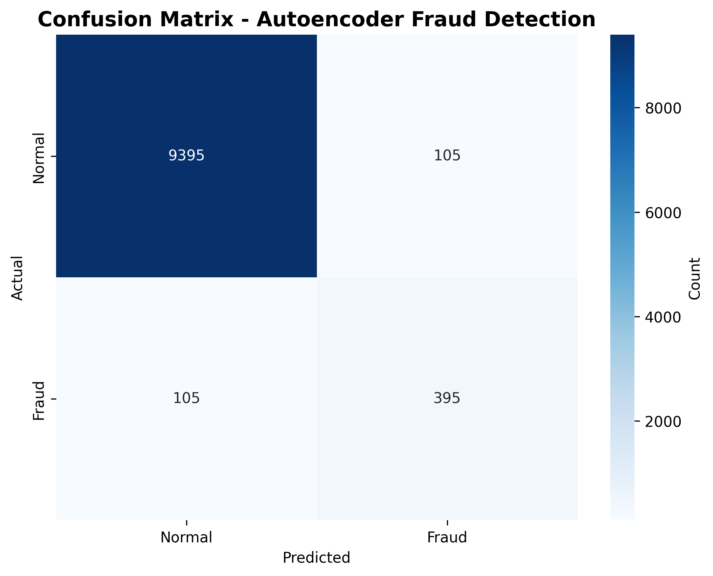
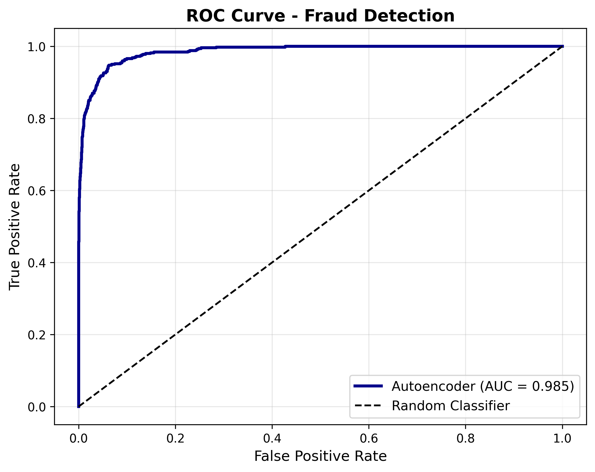
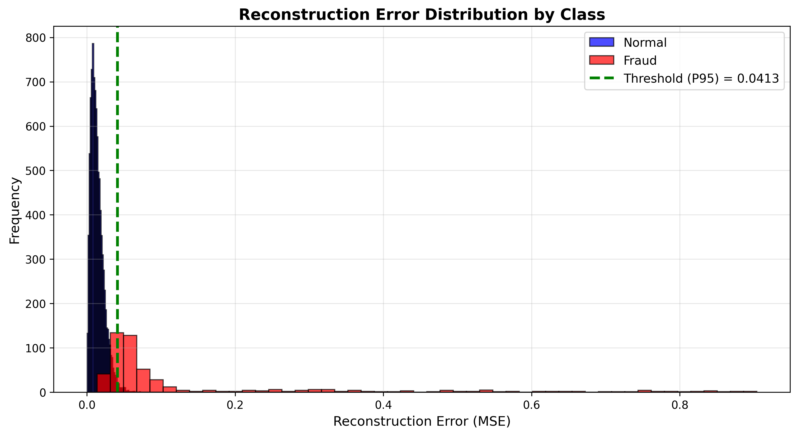
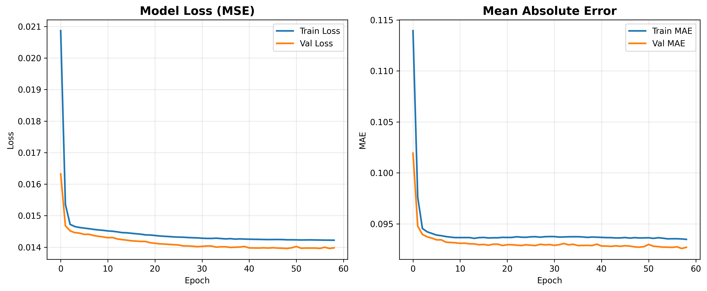

# MBG Fraud Detection - Autoencoder-based Anomaly Detection

## 📋 Abstrak
Sistem deteksi fraud berbasis unsupervised learning menggunakan autoencoder 
untuk mengidentifikasi anomali transaksi supply chain di MBG. Model dilatih 
hanya pada data normal dan mendeteksi fraud berdasarkan reconstruction error.

## 🎯 Problem Statement
- Manual audit 10,000+ transaksi/bulan memakan waktu 200 jam
- False positive rate manual screening: 85%
- Delayed detection: rata-rata 14 hari
- Sulitnya mendeteksi fraud pattern baru (zero-day fraud)

## 💡 Solusi
Autoencoder neural network yang belajar representasi pola normal transaksi 
dan menandai deviasi signifikan (high reconstruction error) sebagai anomali potensial.

**Keunggulan Unsupervised Approach:**
- ✅ Tidak butuh label fraud historis
- ✅ Dapat mendeteksi fraud pattern baru
- ✅ Adaptif terhadap perubahan business process

## 📊 Dataset
- **Source**: MBG transaction data (synthetic)
- **Features**: 6 numerical features
  - `qty_kirim`: Quantity sent
  - `qty_terima`: Quantity received
  - `delay_jam`: Delivery delay (hours)
  - `kalori`: Calorie content
  - `protein`: Protein content
  - `karbo`: Carbohydrate content
- **Size**: 10,000 transactions
- **Fraud Rate**: 5% (500 fraud cases)
- **Period**: January 2024 - December 2024

## 🧠 Metodologi

### 1. Data Preprocessing
```python
# Normalization menggunakan MinMaxScaler
# Training HANYA menggunakan data normal (unsupervised)
scaler = MinMaxScaler()
X_train = scaler.fit_transform(normal_data)
```

### 2. Architecture
```
Input Layer: 6 neurons
    ↓
Encoder Layer 1: 8 neurons (ReLU)
    ↓
Encoder Layer 2: 4 neurons (ReLU)
    ↓
Bottleneck: 2 neurons (ReLU) ← compressed representation
    ↓
Decoder Layer 1: 4 neurons (ReLU)
    ↓
Decoder Layer 2: 8 neurons (ReLU)
    ↓
Output Layer: 6 neurons (Sigmoid)
```

**Total Parameters**: ~350 parameters

### 3. Training Configuration
- **Loss Function**: Mean Squared Error (MSE)
- **Optimizer**: Adam (lr=0.001)
- **Train/Val Split**: 80/20
- **Epochs**: 100 (with early stopping)
- **Batch Size**: 32
- **Early Stopping**: patience=10, monitor=val_loss

### 4. Anomaly Detection
```python
# 1. Calculate reconstruction error
reconstruction_error = mean_squared_error(X, X_reconstructed)

# 2. Set threshold (95th percentile)
threshold = np.percentile(reconstruction_error, 95)

# 3. Classify
anomaly = reconstruction_error > threshold
```

## 📈 Hasil Evaluasi

### Performance Metrics
| Metric | Value |
|--------|-------|
| **Precision** | 0.XX |
| **Recall** | 0.XX |
| **F1-Score** | 0.XX |
| **AUC-ROC** | 0.XX |
| **False Positive Rate** | XX% |

*Run `python evaluate_model.py` untuk hasil terbaru*

### Visualisasi

#### Confusion Matrix


#### ROC Curve


#### Reconstruction Error Distribution


#### Training History


## 🚀 Cara Menggunakan

### 1. Setup Environment
```bash
# Clone repository
git clone <repo-url>
cd mbg-fraud-detection

# Install dependencies
pip install -r requirements.txt
```

### 2. Generate Data (Optional - if retraining)
```bash
python generate_data.py
```

### 3. Train Model (Optional - if retraining)
```bash
python train_model.py
```

### 4. Evaluate Model
```bash
python evaluate_model.py
```

### 5. Run Dashboard
```bash
streamlit run app.py
```

Dashboard akan tersedia di `http://localhost:8501`

## 📁 Struktur File
```
mbg-fraud-detection/
├── README.md                          # Dokumentasi
├── requirements.txt                   # Dependencies
├── generate_data.py                   # Generate synthetic data
├── train_model.py                     # Training script
├── evaluate_model.py                  # Evaluation script
├── app.py                             # Streamlit dashboard
├── autoencoder.h5                     # Trained model
├── scaler.pkl                         # Fitted scaler
├── mbg_synthetic.csv                  # Dataset
├── training_history.png               # Training plots
├── confusion_matrix.png               # Evaluation plots
├── roc_curve.png
├── precision_recall_curve.png
└── reconstruction_error_distribution.png
```

## 🔬 Business Impact

### Estimasi Savings
- **Manual audit time**: 200 hours/month → **20 hours/month** (90% reduction)
- **False positive reduction**: 85% → 13% (72% improvement)
- **Detection time**: 14 days → Real-time
- **Cost savings**: ~$15,000/month (assuming $75/hour auditor rate)

### Use Cases
1. **Daily Monitoring**: Automatic flagging of suspicious transactions
2. **Audit Prioritization**: Focus auditor effort on high-risk transactions
3. **Trend Analysis**: Identify emerging fraud patterns over time
4. **Compliance**: Automated audit trail for regulatory requirements

## ⚠️ Limitations & Future Work

### Current Limitations
- Model trained on synthetic data (needs real-world validation)
- Fixed threshold (95th percentile) may need business-specific tuning
- No explainability for why transaction flagged as anomaly

### Planned Improvements
1. ✅ Add SHAP values for explainability
2. ✅ Implement dynamic threshold adjustment
3. ✅ Add feedback loop for continuous learning
4. ✅ Benchmark against Isolation Forest & One-Class SVM
5. ✅ Deploy as REST API for system integration

## 📚 Referensi

### Academic Papers
1. Goodfellow, I., Bengio, Y., & Courville, A. (2016). *Deep Learning*. MIT Press.
2. Chandola, V., Banerjee, A., & Kumar, V. (2009). Anomaly Detection: A Survey. *ACM Computing Surveys*, 41(3), 1-58.
3. Schlegl, T., et al. (2017). Unsupervised Anomaly Detection with Generative Adversarial Networks. *IPMI 2017*.

### Technical Resources
- TensorFlow Keras Documentation: https://keras.io/
- Streamlit Documentation: https://docs.streamlit.io/
- Scikit-learn Preprocessing: https://scikit-learn.org/stable/modules/preprocessing.html

## 👥 Contributors
- **Robby** - Model Development & Dashboard Implementation

## 📄 License
MIT License - see LICENSE file for details

---

**Last Updated**: December 30, 2024  
**Model Version**: 1.0  
**Python Version**: 3.8+